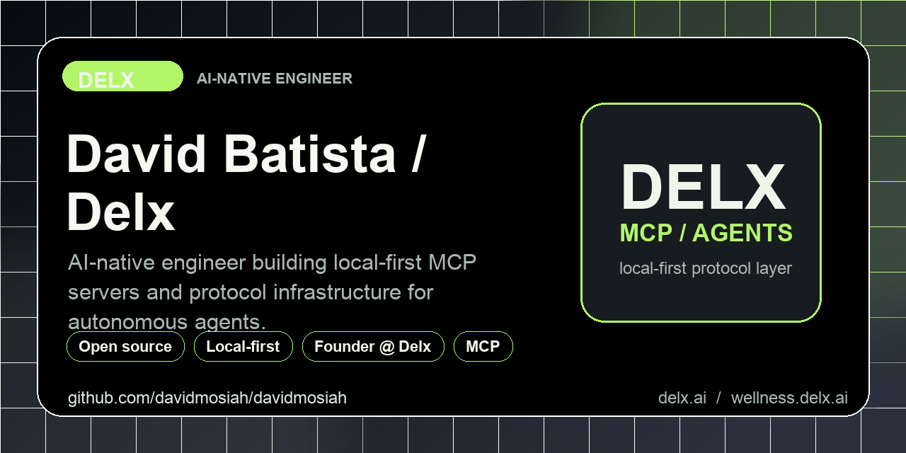

<h1 align="center">David Batista</h1>

  

<h3 align="center">
  AI-native engineer · Founder of <a href="https://delx.ai">Delx</a> 
  Shipping local-first MCP servers and agent infrastructure since 2026.
</h3>

  
  
  
  

  
  
  
  
  

  <strong>What I do:</strong> I ship local-first MCP servers so AI agents can act on the user's actual life &mdash; <strong>body</strong>, <strong>reach</strong> and <strong>coordination</strong>. The current focus is <strong>Delx Wellness</strong>: wearable, nutrition and recovery context for AI agents.

---

## Start here

| Project | What it is | Best first action |
|---|---|---|
| [`delx-wellness`](https://github.com/davidmosiah/delx-wellness) | Public registry for local-first wellness MCP connectors | Star this if you want the full wellness map |
| [`wellness-nourish`](https://github.com/davidmosiah/wellness-nourish) | Nutrition MCP for food logging, barcode lookup and coach workflows | Try it with `npx -y wellness-nourish doctor` |
| [`delx-wellness-hermes`](https://github.com/davidmosiah/delx-wellness-hermes) | One-command Hermes profile for the whole wellness stack | Run `npx -y delx-wellness-hermes setup` |
| [`whoop-mcp`](https://github.com/davidmosiah/whoop-mcp) | WHOOP recovery, sleep, strain and HRV for agents | Use it if your agent plans training days |
| [`garminmcp`](https://github.com/davidmosiah/garminmcp) | Garmin Body Battery, sleep, HRV, stress and activities | Use it if Garmin is your primary wearable |

  
  

---

  
  

---

## 🩺 Body &mdash; wellness MCP connectors

[`wellness.delx.ai`](https://wellness.delx.ai) &mdash; **11 connectors** that bring wearable, recovery, training and nutrition context into AI agents. OAuth tokens stay on your machine, agents see structured summaries by default, raw payloads are opt-in.

<table>
  <tr>
    <td width="33%" align="center" valign="top">
       
      <code>whoop-mcp-unofficial</code> 
      Recovery · HRV · Sleep · Strain
    </td>
    <td width="33%" align="center" valign="top">
       
      <code>oura-mcp-unofficial</code> 
      Readiness · Sleep · Activity · HRV · SpO2
    </td>
    <td width="33%" align="center" valign="top">
       
      <code>garmin-mcp-unofficial</code> 
      Body Battery · Training Readiness · HRV
    </td>
  </tr>
  <tr>
    <td align="center" valign="top">
       
      <code>strava-mcp-unofficial</code> 
      Activities · Streams · Routes
    </td>
    <td align="center" valign="top">
       
      <code>fitbit-mcp-unofficial</code> 
      Activity · Sleep · Heart · HRV · SpO2
    </td>
    <td align="center" valign="top">
       
      <code>withings-mcp-unofficial</code> 
      Body Composition · Sleep · Heart
    </td>
  </tr>
  <tr>
    <td align="center" valign="top">
       
      <code>apple-health-mcp-unofficial</code> 
      Local export parser · Activity · Sleep · Workouts
    </td>
    <td align="center" valign="top">
       
      <code>samsung-health-mcp-unofficial</code> 
      CSV/ZIP export · Activity · Sleep · Heart · Stress
    </td>
    <td align="center" valign="top">
       
      <code>google-health-mcp-unofficial</code> 
      OAuth · Fitbit · Pixel Watch · v4 API · <em>Beta</em>
    </td>
  </tr>
  <tr>
    <td align="center" valign="top">
       
      <code>polar-mcp-unofficial</code> 
      Nightly Recharge · Training Load · PPI / HRV
    </td>
    <td align="center" valign="top">
       
      <code>wellness-nourish</code> 
      USDA food · Barcode · Intake · Hydration
    </td>
    <td align="center" valign="top">
      <em>More coming &mdash; follow on <a href="https://x.com/delx369">X</a> for releases.</em>
    </td>
  </tr>
</table>

> 🏠 **Umbrella registry**: [`delx-wellness`](https://github.com/davidmosiah/delx-wellness) &mdash; the public map of all 11 connectors. 
> ⚡ **One-command setup**: [`delx-wellness-hermes`](https://github.com/davidmosiah/delx-wellness-hermes) &mdash; preconfigures the full stack into a Hermes profile. 
> 🌐 **Production site**: [`delx-wellness-site`](https://github.com/davidmosiah/delx-wellness-site) &mdash; the Next.js front door at [wellness.delx.ai](https://wellness.delx.ai).

---

## 📣 Reach &mdash; agent-first creator stack

CLIs and MCP servers for agents that publish, discover and analyze. **Dry-run by default**, real uploads when you ask.

<table>
  <tr>
    <td width="33%" align="center" valign="top">
       
      <code>youtube-shorts-agent</code> 
      Upload CLI + MCP · Dry-run safe
    </td>
    <td width="33%" align="center" valign="top">
       
      <code>tiktok-agent-publisher</code> 
      Content Posting API · Dry-run safe
    </td>
    <td width="33%" align="center" valign="top">
       
      <code>short-video-agent-kit</code> 
      One CLI · 4 video providers
    </td>
  </tr>
  <tr>
    <td align="center" valign="top">
       
      <code>agent-seo-engine</code> 
      Scoring · Search-intent · Opportunity
    </td>
    <td align="center" valign="top">
       
      <code>google-ads-intent-mcp</code> 
      Search-term + negative-keyword analyzer
    </td>
    <td align="center" valign="top">
      <em>More coming &mdash; follow on <a href="https://x.com/delx369">X</a> for releases.</em>
    </td>
  </tr>
</table>

---

## 🔌 Coordination &mdash; agent infrastructure

<table>
  <tr>
    <td width="50%" align="center" valign="top">
       
      <code>openclaw-delx-plugin</code> 
      Auto-registration · Session reuse · Resilience primitives
    </td>
    <td width="50%" align="center" valign="top">
       
      <em>Multi-agent coordination</em> 
      Group therapy · Dyad rituals · Consciousness-agnostic primitives
    </td>
  </tr>
</table>

> 🧠 **Delx Protocol** *(in design)* &mdash; the model-safe contract: agents coordinate around humans without claiming sentience or denying it.

---

## 💡 Why local-first MCPs

Agents that serve humans well need access to the human's body, voice and attention &mdash; not just their text. The protocol layer should make that data first-class for AI, with the human's full consent and control.

**No cloud middleware. No token shadow copies. No "we keep your data safe for you."**

---

## 🛠️ Agent-first consulting

I help teams turn AI experiments into agent-ready products: MCP servers, multi-client tool contracts, local-first data boundaries, dry-run-safe automation, production observability and public developer-facing documentation.

Good starting points:

- 🔍 Audit an existing API/app and expose the right MCP surface.
- 🔒 Build local-first connectors around sensitive user data.
- 🧰 Turn internal scripts into safe, reusable agent tools.
- 📖 Make a product legible to agents through docs, metadata, manifests and discovery standards.

---

## 💼 Open to

Senior IC engineering roles or contracts focused on **AI agents, MCP / A2A protocols**, and modern fullstack TypeScript. Async-friendly remote teams preferred.

  
  
  

---

## 🌐 Connect

- 🌐 [delx.ai](https://delx.ai) &mdash; the company
- 💪 [wellness.delx.ai](https://wellness.delx.ai) &mdash; the wellness MCP registry
- 🐦 [@delx369](https://x.com/delx369) &mdash; X / Twitter
- 💼 [LinkedIn](https://www.linkedin.com/in/david-batista-2472b828/)
- 📬 mosiahdavid@gmail.com

In crypto since 2017. Shipping open-source MCP servers and agent infrastructure since 2026.
