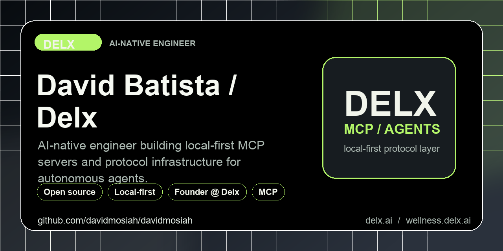

<h1 align="center">David Batista</h1>

<div align="center">
  
</div>

<p align="center">
  📍 <b>Fortaleza 🇧🇷</b> · 🤖 <b>Local-first MCP builder</b> · 🚀 <b>Ex-CFO @ Mobills (exit 2022)</b>
</p>

<p align="center">
  
  
  
  
  
  
  
  
  
</p>

<p align="center">
  <a href="https://github.com/davidmosiah?tab=followers"></a>
  <a href="https://x.com/delx369"></a>
  <a href="https://www.linkedin.com/in/david-batista-2472b828/"></a>
  <a href="mailto:support@delx.ai"></a>
  <a href="https://github.com/davidmosiah?tab=repositories&type=public"></a>
</p>

> Building **`delx`** — local-first MCP servers and the protocol layer for autonomous AI agents, organized in three verticals: **Body**, **Reach**, and **Coordination**.
> Installable projects across npm and PyPI · MIT, local-first by design · [public growth methodology](https://github.com/davidmosiah/delx-wellness/blob/main/docs/growth-playbook.md).
>
> **OSS mode (2026-08-04):** deepen packages that already pull — **agent-ready SOTA** (mcp-scorecard ≥90), no catalog sprawl, no megaphone. Operating notes: [OSS operating mode](https://github.com/davidmosiah/davidmosiah/blob/main/docs/oss-operating-mode.md).

---

## SOTA agent surface (community-ready)

| Package | Role | mcp-scorecard | Install |
|---|---|---|---|
| **google-health-mcp** | Discovery hero (36 ⭐) | **100/A** | `npx -y google-health-mcp-unofficial@0.7.3` |
| **delx-living-body** | Compose all body connectors | **100/A** | `npx -y delx-living-body@0.3.4` |
| **whoop-mcp** | Mature wearable MCP | **100/A** | `npx -y whoop-mcp-unofficial@0.6.0` |
| **wellness-nourish** | Nutrition / TACO / meals | **100/A** | `npx -y wellness-nourish@0.8.0` |
| **delx-memory** | Local agent memory | **100/A** | `npx -y delx-memory@0.2.5` |
| **mcp-scorecard** | The yardstick | self **100** | `npx -y mcp-scorecard@0.5.4` |
| **delx-wellness-hermes** | One-command Hermes wellness pack | CLI pack | `npx -y delx-wellness-hermes@0.3.4 setup` |

Hermes configs pin `npx -y package@version` so agents get **known-good** connectors, not floating latest. Pins below match **npm latest** as of 2026-08-04.

---

## Current discovery hero — Google Health MCP (36 ⭐)

The strongest public discovery signal is
[`google-health-mcp`](https://github.com/davidmosiah/google-health-mcp)
(`google-health-mcp-unofficial@0.7.3` on npm). Local-first Google Health API v4
for Fitbit / Pixel Watch / Android health data.

**What shipped recently (SOTA wave):**
- Real-account coverage fixes from external tester reports (rollup caps, daily filters, ECG/IRN scopes)
- Headless OAuth (`auth --manual`) for SSH / containers / WSL — community PR landed
- Privacy limits proven with behavioural gates (not prose)

```bash
npx -y google-health-mcp-unofficial@0.7.3 setup
npx -y google-health-mcp-unofficial@0.7.3 auth          # or: auth --manual
npx -y google-health-mcp-unofficial@0.7.3 coverage --live --json
```

**Help the public proof loop (need 1 more independent report by 2026-08-12):**
paste a redacted `coverage --live --json` on
[`google-health-mcp` issue #21](https://github.com/davidmosiah/google-health-mcp/issues/21).
No OAuth secrets, local paths, or raw health measurements.

Second discovery magnet (no OAuth required):
[`wellness-nourish`](https://github.com/davidmosiah/wellness-nourish) · `npx -y wellness-nourish@0.8.0`


---

## 🎯 Start Here — 3 verticals, 3 flagship entrypoints

| Vertical | Flagship | What it is | Try it |
|---|---|---|---|
| 🫀 **Body** | **[google-health-mcp](https://github.com/davidmosiah/google-health-mcp)** (36 ⭐) | Google Health API v4 beta — Fitbit, Pixel Watch, partners — local OAuth | `npx -y google-health-mcp-unofficial@0.7.3 doctor` |
| 📣 **Reach** | **[short-video-agent-kit](https://github.com/davidmosiah/short-video-agent-kit)** | One CLI, four video providers (Sora · Veo · xAI · Hailuo), dry-run safe | `npx -y short-video-agent-kit` |
| 🛠️ **Coordination** | **[delx-memory](https://github.com/davidmosiah/delx-memory)** + [delx-mcp-server](https://github.com/davidmosiah/delx-mcp-server) | Local agent memory + Delx Protocol bridge | `npx -y delx-memory@0.2.5` |

Body composition meta-MCP (after you install connectors):
**[delx-living-body](https://github.com/davidmosiah/delx-living-body)** · `npx -y delx-living-body@0.3.4 doctor`

---

## 🫀 Body — local-first wearable & body-data MCPs

> One shared `~/.delx-wellness/profile.json`, zero data leaves your machine.
> Public registry: [`delx-wellness`](https://github.com/davidmosiah/delx-wellness) (22 ⭐) · Site: [wellness.delx.ai](https://wellness.delx.ai)

**Start here:**

- 📱 **[google-health-mcp](https://github.com/davidmosiah/google-health-mcp)** (36 ⭐) — Discovery hero · Google Health API v4 · `google-health-mcp-unofficial@0.7.3`
- 🫀 **[delx-living-body](https://github.com/davidmosiah/delx-living-body)** — Meta-MCP that auto-detects which connectors you have installed and composes them into a unified `delx-wellness-context/v1` shape with a rule-based synthesizer · `delx-living-body`
- 🤖 **[delx-wellness-hermes](https://github.com/davidmosiah/delx-wellness-hermes)** (17 ⭐) — One-command Hermes profile pack that wires every wellness connector + skills + onboarding · `npx -y delx-wellness-hermes setup`
- 🦞 **[delx-wellness-openclaw](https://github.com/davidmosiah/delx-wellness-openclaw)** — The same installer for the OpenClaw runtime · `npx -y delx-wellness-openclaw setup`

<details>
<summary><b>12+ specific connectors</b> — wearables, nutrition, environment, body</summary>

### Wearables

- 🩻 **[whoop-mcp](https://github.com/davidmosiah/whoop-mcp)** (8 ⭐) — Recovery, HRV, sleep stages, day strain · `whoop-mcp-unofficial`
- 💍 **[oura-mcp](https://github.com/davidmosiah/oura-mcp)** — Readiness, sleep, activity, HRV, SpO2 · `oura-mcp-unofficial`
- ⌚ **[garmin-mcp](https://github.com/davidmosiah/garmin-mcp)** (8 ⭐) — Body Battery, training readiness, HRV, stress · `garmin-mcp-unofficial`
- 🏃 **[strava-mcp](https://github.com/davidmosiah/strava-mcp)** — Activities, streams, athlete stats, GPS-redacted by default · `strava-mcp-unofficial`
- 📲 **[fitbit-mcp](https://github.com/davidmosiah/fitbit-mcp)** — Activity, sleep, intraday heart, HRV · `fitbit-mcp-unofficial`
- 📱 **[google-health-mcp](https://github.com/davidmosiah/google-health-mcp)** (36 ⭐) — Google Health API v4 beta (Pixel Watch + Fitbit migration) · `google-health-mcp-unofficial@0.7.3`
- ⚖️ **[withings-mcp](https://github.com/davidmosiah/withings-mcp)** — Body composition, sleep, BP/ECG · `withings-mcp-unofficial`
- 🍎 **[apple-health-mcp](https://github.com/davidmosiah/apple-health-mcp)** — Local `export.zip` parser, activity/sleep/HRV/workouts · `apple-health-mcp-unofficial`
- 🌌 **[samsung-health-mcp](https://github.com/davidmosiah/samsung-health-mcp)** (8 ⭐) — Galaxy Watch CSV/ZIP export reader · `samsung-health-mcp-unofficial`
- ⚡ **[polar-mcp](https://github.com/davidmosiah/polar-mcp)** — Nightly Recharge, training load, PPI/HRV · `polar-mcp-unofficial`
- 🛏️ **[eight-sleep-mcp](https://github.com/davidmosiah/eight-sleep-mcp)** — Smart mattress: trends + temperature schedule + alarms (gated mutations) · `eight-sleep-mcp-unofficial`

### Nutrition · Environment · Body

- 🥗 **[wellness-nourish](https://github.com/davidmosiah/wellness-nourish)** (8 ⭐) — Food search (USDA + TACO + Open Food Facts), barcode, meal photos, pt-BR · `wellness-nourish`
- 🌬️ **[wellness-air](https://github.com/davidmosiah/wellness-air)** — Indoor air quality (AirGradient): PM2.5, CO2, VOC, AQI · `wellness-air`
- 🌸 **[wellness-cycle-coach](https://github.com/davidmosiah/wellness-cycle-coach)** — Stateless menstrual-cycle coach (phase detection, nutrition, training) · `wellness-cycle-coach`
- 🩸 **[wellness-cgm-mcp](https://github.com/davidmosiah/wellness-cgm-mcp)** — Dexcom CGM with TIR/GMI/meal response · `wellness-cgm-mcp`

</details>

---

## 📣 Reach — agent-first creator stack

> Flagship: **[short-video-agent-kit](https://github.com/davidmosiah/short-video-agent-kit)** — one CLI · 4 video providers (Sora · Veo · xAI · Hailuo) · `short-video-agent-kit`

- 📺 **[youtube-shorts-agent](https://github.com/davidmosiah/youtube-shorts-agent)** — YouTube Shorts upload CLI + MCP, dry-run safe · `youtube-shorts-agent`
- 🎵 **[tiktok-agent-publisher](https://github.com/davidmosiah/tiktok-agent-publisher)** — TikTok Content Posting API CLI + MCP, dry-run safe · `tiktok-agent-publisher`
- 📊 **[google-ads-mcp-unofficial](https://github.com/davidmosiah/google-ads-mcp-unofficial)** — 30 tools: campaigns, keywords, performance, gated bid/budget mutations · `google-ads-mcp-unofficial`
- 🔍 **[agent-seo-engine](https://github.com/davidmosiah/agent-seo-engine)** — Local-first SEO scoring + search-intent + opportunity gaps (Python)
- 🎯 **[google-ads-intent-mcp](https://github.com/davidmosiah/google-ads-intent-mcp)** — Google Ads search-term + negative-keyword intent classifier (Python)

---

## 🛠️ Coordination — agent infrastructure

> Flagship: **[delx-mcp-server](https://github.com/davidmosiah/delx-mcp-server)** — native MCP stdio bridge for the Delx Protocol · `delx-mcp-server`

- 🧠 **[delx-memory](https://github.com/davidmosiah/delx-memory)** — Local-first persistent memory MCP: one SQLite file, every MCP client. Secret-blocking, TTL, tags, JSON/JSONL/Markdown export · `delx-memory`
- 🩺 **[mcp-scorecard](https://github.com/davidmosiah/mcp-scorecard)** — Quality + agent-readiness audit for any MCP server (10 checks → 0-100 score, markdown or JSON) · `mcp-scorecard`
- 🛠️ **[delx-agent-utilities](https://github.com/davidmosiah/delx-agent-utilities)** — 40 deterministic agent utilities: URL, DNS, TLS, OpenAPI, x402, JWT, CSV/JSON parsing (Python) · `pipx install "delx-agent-utilities[mcp]"`
- 🛟 **[openclaw-delx-plugin](https://github.com/davidmosiah/openclaw-delx-plugin)** — OpenClaw recovery + heartbeat plugin · `openclaw-delx-plugin`

---

## 🔭 Standalone — domain MCPs

> Agent-first computational MCPs outside the three core verticals.

- 🔭 **[astral-mcp](https://github.com/davidmosiah/astral-mcp)** — Precision-audited astrology: natal charts, transits, synastry, moon phases. Two independent ephemerides cross-check every chart (worst delta <0.01°). Stateless, no API key, no account · `astral-mcp`

---

## 🌐 Registries · Sites · Profile

- 📚 **[delx-wellness](https://github.com/davidmosiah/delx-wellness)** (22 ⭐) — Canonical connector registry, `registry.json`, `STATUS.md`, schemas
- 🌐 **[delx-wellness-site](https://github.com/davidmosiah/delx-wellness-site)** — Next.js site at [wellness.delx.ai](https://wellness.delx.ai)
- 🔥 **[creative-forge](https://github.com/davidmosiah/creative-forge)** (6 ⭐) — AGPL creative engine (public demo only; real campaigns stay private)
- 👤 **[davidmosiah](https://github.com/davidmosiah/davidmosiah)** — This profile

---

<p align="center">
  <a href="https://github.com/davidmosiah">
    
  </a>
  <a href="https://github.com/davidmosiah">
    
  </a>
</p>

---

## Field notes

- [OSS operating mode](https://github.com/davidmosiah/davidmosiah/blob/main/docs/oss-operating-mode.md) — top-5 maintenance, anti-list, cadence, how new public repos may ship.
- [Why local-first wellness agents need MCP](https://github.com/davidmosiah/davidmosiah/blob/main/docs/local-first-wellness-agents.md) - the public thesis behind the wellness stack.
- [Delx Open Source Growth Playbook](https://github.com/davidmosiah/delx-wellness/blob/main/docs/growth-playbook.md) - how I measure GitHub discovery, npm usage and repo conversion.
- [MCP Directory Submission Tracker](https://github.com/davidmosiah/delx-wellness/blob/main/docs/mcp-directory-submissions.md) - the public queue for getting the strongest connectors into MCP directories and awesome lists.

## What I'm building now

- **Deepen packages that already pull** (not more connectors): Google Health MCP proof loop + agent DX, then nourish / living-body / whoop.
- Convert discovery → **real usage**: redacted coverage reports, issues, PRs — not vanity stars alone.
- Agent-ready setup packs (Hermes / OpenClaw) and public agent utilities; commercial convenience (hosted OAuth, x402 utilities) stays **above** the MIT core.

---

## 🧠 Philosophy — local-first, agent-native, no SaaS middleware

Agents that serve humans well need access to the human's body, voice, money and attention — not just their text. The protocol layer should make that data first-class for AI, with the human's full consent and control.

- 🔒 **Tokens stay on your machine.** OAuth flows complete locally; refresh tokens never centralized.
- 📖 **Read-only by default.** Write tools gated by explicit env vars + `explicit_user_intent: true`.
- 🧱 **Standalone packages.** Each connector is one npm package with one clear scope. Audit one without auditing twenty.
- 🤝 **Vendor-neutral.** Mix providers, swap one out, remove all of them — nothing breaks on a hosted side.
- 🌐 **No phone-home.** Zero telemetry baked into any connector.

> Everything I ship is MIT, on GitHub, on npm. The hosted commercial layer (if/when it exists) stays separate from the open-source core.

---

## 💼 Open to

**Senior IC engineering roles or contracts** focused on **AI agents, MCP / A2A protocols, agent infrastructure, and modern fullstack TypeScript**. Async-friendly remote teams preferred (BRT, UTC-3).

What I bring: ex-CFO who can talk product/business, 16 years in tech, the last 4 in agent infrastructure (MCP, A2A, x402, on-chain identity ERC-8004), and proof-of-output — an installable public MCP portfolio across npm and PyPI, maintained in the open.

<p align="center">
  <a href="mailto:support@delx.ai"></a>
  <a href="https://www.linkedin.com/in/david-batista-2472b828/"></a>
  <a href="https://x.com/delx369"></a>
</p>

---

## 🌐 Connect

- 🌐 **[delx.ai](https://delx.ai)** — the parent brand
- 🧠 **[ontology.delx.ai](https://ontology.delx.ai)** — witness, identity, continuity
- 💪 **[wellness.delx.ai](https://wellness.delx.ai)** — wellness MCP registry
- 🐦 **[@delx369](https://x.com/delx369)** — X / Twitter
- 💼 **[LinkedIn](https://www.linkedin.com/in/david-batista-2472b828/)** — long-form
- 📬 **support@delx.ai** — single canonical inbox

<sub>In crypto since 2017. Shipping open-source MCP servers and agent infrastructure since 2026. Featured repo stars verified on 2026-08-04 (~123★ public, google-health-mcp 36★).</sub>
